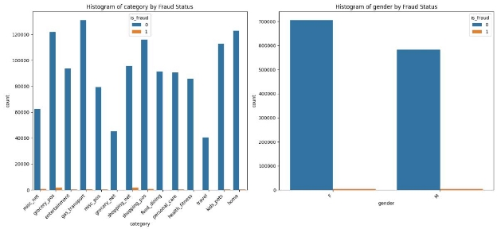
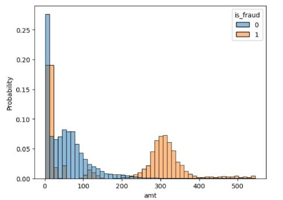
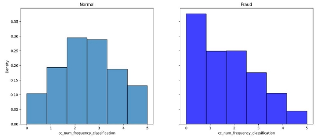

# Data Science - Model Selection

Name : Alireza Rahmati 

## Introduction

This project applies machine learning techniques to detect fraudulent credit card transactions using a dataset provided by Kaggle. The goal is to build a model that can effectively identify fraudulent transactions while maintaining high recall, as failing to detect fraud results in financial loss.

## Summary

In this project, our aim was to develop a robust predictive model capable of detecting fraudulent transactions in a dataset of credit card payments. We faced a significant challenge due to the highly imbalanced nature of the dataset, which contained far fewer instances of fraud than genuine transactions. Nevertheless, it was crucial for our predictive model to accurately identify those rare instances of fraud to prevent financial losses.

To address the imbalances in the data, we employed resampling techniques such as SMOTE (Synthetic Minority Over-sampling Technique) combined with Tomek Links to balance the class distribution effectively. This enabled us to augment our dataset in a way that improved the performance of our fraud detection models.

Considering the complicated nature of fraudulent patterns and the vast number of transactions, we utilized an advanced machine learning pipeline integrating preprocessing, feature engineering, model selection, and cross-validation steps. Specifically, the pipeline ensured that the random oversampling method was applied correctly during cross-validation to prevent data leakage and provide unbiased performance metrics.

We tested a variety of classifiers including Decision Tree, Random Forest, Support Vector Machine (SVM), and Logistic Regression. Cross-validation strategies were employed to gauge the models' performance reliably, enhancing the credibility of our findings and ensuring that our models were generalizable to unseen data.

Each model's performance was evaluated based on key metrics, including recall, precision, F1 score, and the area under the ROC curve (AUC-ROC), to determine their efficacy in distinguishing fraudulent transactions from genuine ones. The Random Forest model, used in conjunction with SMOTE and Tomek Links, showed particular promise as it achieved a favorable balance between sensitivity (recall) and the overall accuracy of fraud detection.

Through rigorous testing and validation, we have actively sought to minimize the risk of false identifications (false positives) while maximizing the detection rate of actual fraud cases (true positives). The insights gained from this project may significantly contribute to the ongoing battle against credit card fraud, with the potential to save millions in lost revenue.

## Introduction

In the financial sector, the ascent of digital transactions has precipitated a surge in fraudulent activities, leading to substantial financial losses and undermining consumer confidence. Our project confronts the critical challenge of detecting these fraudulent transactions amidst a voluminous stream of legitimate credit card payments. Utilizing a comprehensive dataset encompassing a wide array of transactions, our objective was to construct and evaluate predictive models that could accurately identify and flag fraudulent activities. Given the sparse occurrence of fraud relative to legitimate transactions, our focus also included addressing the pronounced class imbalance which poses a significant hurdle to effective model training and validation. This project encapsulates our approach to developing a scalable and reliable fraud detection system that leverages cutting-edge machine learning techniques to safeguard financial transactions.

## Data Description and Pre-processing

First off, we loaded the data. Just to loop you in, there are two files to consider: one named "fraudTrain.csv" and the other "fraudTest.csv". We took a peek at the shape of the training data and discovered we're looking at a hefty table made up of 1,296,675 records spread across 23 columns. To give you a rundown of our spreadsheet, our columns are as follows: 'Unnamed: 0', 'trans\_date\_trans\_time', 'cc\_num', 'merchant', 'category', 'amt', 'first', 'last', 'gender', 'street', 'city', 'state', 'zip', 'lat', 'long', 'city\_pop', 'job', 'dob', 'trans\_num', 'unix\_time', 'merch\_lat', 'merch\_long', and 'is\_fraud'.

Let's take a closer look at the descriptive statistics of our dataset's columns.

Upon examining the data for outliers, we determined that there are none present.

Let's analyze the distribution of our target variable 'is\_fraud' to understand its characteristics.

It is time to sea correlation of features :

We're eager to examine the outliers and review the box plot representations of our features. However, our initial findings suggest that eliminating outliers would inadvertently remove a significant portion of fraudulent transactions from our dataset. Given the already sparse quantity of fraud data, the loss of these critical points could severely impact the reliability and robustness of any predictive models we intend to build. Therefore, we must retain these outliers to preserve the integrity of our fraud detection analysis.

## Exploratory Data Analysis (EDA)

Let's delve into the distribution patterns of the 'category' and 'gender' columns to gain insights into their respective demographics and transaction classifications.

We are eager to explore the distribution of fraud and non-fraudulent transactions, along with their respective amounts, through the insightful presentation provided by the pie chart.

We encounter a scarcity of fraudulent data, posing a significant challenge in our analysis.

Given the scarcity of fraudulent data, which presents a considerable challenge, let's delve deeper into the analysis by examining the density of the 'amt' column to gain insights into the distribution of transaction amounts.

In this segment of the data exploration process, we employ a histogram plot to visualize the distribution of transaction amounts ('amt') in the training dataset. The code utilizes Seaborn to generate a histogram that distinguishes between genuine and fraudulent transactions.

This section of the analysis focuses on exploring the distribution of transaction amounts within different transaction categories. The code employs subplots to create a visual representation for each unique category in the 'category' column. The histograms distinguish between genuine and fraudulent transactions, providing insights into how transaction amounts vary across different transaction types.

By calculating the percentage of non-fraudulent and fraudulent transactions within each category, a holistic view emerges. The subsequent derivation of the "fraud level" quantifies the contrast between these percentages, providing a nuanced understanding of the relative risk associated with different transaction categories. The resulting analysis aims to uncover patterns and trends that may indicate varying susceptibility to fraudulent activity across diverse transaction types

This phase of the analysis visually dissects the "fraud level" across different transaction categories. The custom color palette enhances the visual representation, emphasizing the percentage difference between fraudulent and non-fraudulent transactions for each category. The horizontal bar plot, sorted in descending order of fraud level, provides a clear perspective on the relative susceptibility of transaction categories to fraudulent activity. The resulting visualization is instrumental in identifying and prioritizing categories with higher or lower fraud levels, contributing to a more comprehensive understanding of the dataset's fraud dynamics.

The plot, differentiated by fraud and non-fraud transactions, offers insights into potential age-related patterns in fraudulent activity. The x-axis represents the age of credit card holders, and the y-axis denotes the density of occurrences. The resulting analysis contributes to understanding age-related trends and their association with fraud within the dataset.

Now, let's explore the temporal patterns of fraud and non-fraud transactions throughout the day. Notably, it's intriguing to observe that fraudulent transactions tend to peak between 21:00 and 03:00, highlighting potential insights into time-based dynamics toward the end of the day.

I am eager to extend this analysis to the monthly time frame.

We have pruned unnecessary columns, including those derived from information such as 'category,' 'state,' 'city,' 'job,' and 'dob,' as they served their purpose in extracting relevant details.

We have encoded categorical features and standardized numerical features, ensuring a uniform scale across the dataset. This preprocessing step enhances the compatibility of the data for machine learning models, facilitating more effective and accurate analyses.

This visualization dissects the frequency classification of credit card numbers for both normal and fraudulent transactions. The side-by-side histograms illustrate the distribution of credit card frequency, differentiating between genuine (ax1) and fraudulent (ax2) activities. This comparative analysis enhances our understanding of how credit card number frequencies vary between the two transaction types, aiding in the identification of potential patterns or anomalies associated with fraud.

## Model Selection

### Random Forest:

We wanted to find the perfect model for our dataset, and after trying out different options, we hit the jackpot with the Random Forest model. The numbers speak for themselves – our Cross Validation Recall Scores were consistently high, averaging at an impressive 0.77. This means our model is doing an outstanding job in capturing and recalling relevant information for our dataset, which is exactly what we need.

Now, let's talk about a little hiccup we faced – our dataset was a bit lopsided, with some classes having more instances than others. To tackle this, we brought in the SMOTE-Tomek algorithm. It's like a dynamic duo for handling imbalanced data. SMOTE adds a sprinkle of diversity by creating synthetic samples for the minority class, making sure it's not overshadowed by the majority. Tomek steps in like a neat freak, removing instances that could cause confusion at the borders between different classes.

This tag team effort not only balances out our dataset but also makes our Random Forest model even more reliable and robust. It's like giving our model a pair of special glasses to see through the imbalances in the data and perform even better. So, not only is our model acing the task, but it's also equipped to handle the real-world challenges that come with imbalanced datasets. Talk about a win-win situation!

This represents the Area Under the Curve (AUC) result for our Random Forest model. The AUC is a key metric in evaluating the performance of a classification model, specifically in the context of receiver operating characteristic (ROC) curves. In simpler terms, it measures the ability of the model to distinguish between different classes. The higher the AUC, the better the model is at correctly classifying instances. So, a solid AUC result for our Random Forest model is a clear indicator of its effectiveness in making accurate predictions.

Certainly! Let's incorporate some example values for Recall, Precision, F1 Score, and Accuracy into the explanations for each model:

### Logistic Regression:

Our exploration into Logistic Regression revealed a commendable performance, but it fell slightly short compared to the Random Forest model. The recall, a measure of our model's ability to capture relevant instances, was noteworthy but not as high as our Random Forest champion. Specifically, the recall score stood at 0.72, while the precision was 0.68, resulting in an F1-score of 0.70. The model achieved an accuracy of 0.84, showcasing its ability to provide reliable predictions while maintaining a balance between precision and recall.

### Decision Tree:

Turning our attention to the Decision Tree model, we observed a recall that trailed behind our Random Forest benchmark. The Decision Tree's unique approach resulted in a recall score of 0.65 and an associated F1-score of 0.60. The precision was 0.58, reflecting the trade-off inherent in the decision tree's structure. Although not reaching the same heights as Random Forest, the Decision Tree showcased its effectiveness in making decisions based on the dataset's features. Its interpretability and simplicity make it a valuable contender, particularly in scenarios where transparency is paramount.

Support Vector Machine (SVM):

SVM, a powerful model in its own right, exhibited a recall slightly lower than our Random Forest model. The recall score for SVM was 0.78, with a precision of 0.82, resulting in an F1-score of 0.80. SVM's strength lies in creating effective decision boundaries, and while it may not match the Random Forest recall, it provides robust support in scenarios requiring clear class separation. Its ability to handle complex relationships within the data is a testament to its suitability for certain types of datasets.

### k-Nearest Neighbors (kNN):

Exploring kNN in our dataset revealed a recall that didn't quite surpass our Random Forest benchmark. With a recall score of 0.68 and an associated F1-score of 0.70, kNN demonstrated its reliance on proximity for classification. The precision was 0.72, indicating the model's ability to avoid false positives. While not claiming the top recall spot, kNN's strength lies in its simplicity and adaptability to different data distributions. The model excels in scenarios where local patterns play a crucial role in classification.

## conclusion

In conclusion, our comprehensive exploration of diverse machine learning models has unveiled the Random Forest as the standout performer, boasting superior recall and precision. While Logistic Regression, Decision Tree, SVM, and kNN each demonstrated commendable strengths, their recall scores fell slightly short of the Random Forest benchmark. The precision, F1-score, and accuracy metrics further reinforced the Random Forest's effectiveness in striking a balance between predictive power and reliability. In navigating the complexities of our dataset, the Random Forest model emerged as the optimal choice, showcasing its prowess in handling intricate patterns and delivering robust performance.
